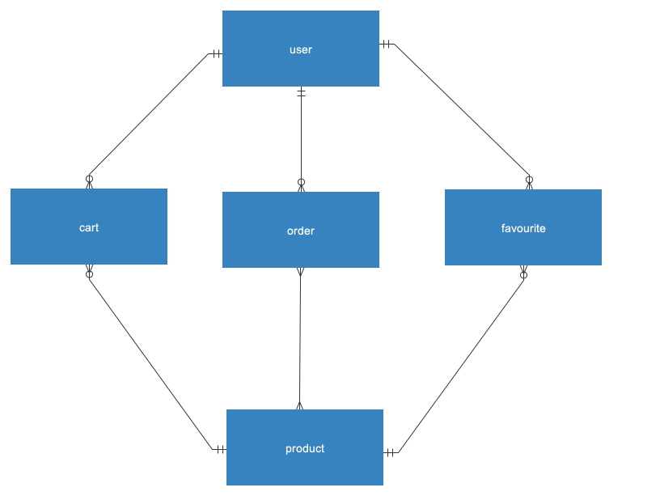

## Introduction

1. Development Environment Requirements
1. Technical Point
1. Project Initialization

---

## Development Environment Requirements

1. Docker 4.x or higher
1. Node.js v16.x or higher, v16.19 is recommended
1. npm is greater than 7 version, v8.19 is recommended
1. Nest CLI 9.x or higher, v9.2 is recommended

---

## Technical

1. **Controller-Service-Repository pattern**
1. **ORM**
    <!-- 1. **IoC/DI** -->
    <!-- 1. Serialization -->
    ---
1. **Docker**

<!-- 1. Express -->
<!-- 1. Lifecycle Events -->

---

### Controller-Service-Repository pattern

|            |                                                        |
| ---------- | ------------------------------------------------------ |
| Controller | management of the REST interface to the business logic |
| Service    | business logic implementation                          |
| Repository | storage of the entity beans in the system              |
---

1. Controller
    - Serialization & Validate
    - Authenticate & Authorization
1. Service
1. Repository

---

### ORM

Object Relational Mapping

1. 兼容多种数据库
1. 映射规则 -- 将 Entity 转换成 数据库的表
1. 迁移（migration）
    - 表结构
    - 数据

---
<!-- 
### IoC/DI

Reference: [IOC Introduction](https://www.tutorialsteacher.com/ioc/introduction)


--- -->

### Docker

1. Image
1. Container

    ---
1. Volume
1. Network

    ---
1. Compose
1. Docker File

---

## Project Initialization

1. Docker Compose file

    ---
1. [Configuration](https://docs.nestjs.com/techniques/configuration)
1. [Typeorm](https://docs.nestjs.com/recipes/sql-typeorm)
1. [Swagger](https://docs.nestjs.com/openapi/introduction)
1. [Serialization](https://docs.nestjs.com/techniques/serialization) & [Validation](https://docs.nestjs.com/techniques/validation)
1. [Authentication](https://docs.nestjs.com/security/authentication) & [Authorization](https://docs.nestjs.com/security/authorization)

---

<!-- ### Tutorial -->

创建项目

```bash
# new a project called `pcp`
$ nest new pcp
```

使用docker 创建 PostgreSQL database container

```bash
# create a file for the docker compose
$ touch docker-compose.yml

# create and start containers
$ docker compose up -d
```

---
[Configuration](https://docs.nestjs.com/techniques/configuration)

```bash
# add dependencies
$ npm i --save @nestjs/config

# create .env file
$ touch .env
```

---

[Typeorm](https://docs.nestjs.com/recipes/sql-typeorm)

```bash
# install dependencies
$ npm i --save @nestjs/typeorm 
# install PostgreSQL Driver
$ npm i --save pg
```

---

```javascript

    TypeOrmModule.forRoot({
      type: 'postgres',
      port: (process.env.POSTGRES_PORT || 5432) as number,
      host: process.env.POSTGRES_HOST,
      database: process.env.POSTGRES_DB,
      username: process.env.POSTGRES_USER,
      password: process.env.POSTGRES_PASSWORD,
      ssl: process.env.POSTGRES_SSL?.toLocaleLowerCase() === 'true' ? true : false,
      autoLoadEntities: true,
      synchronize: true,
      // migrations
    })
```

---

[Swagger](https://docs.nestjs.com/openapi/introduction)

```bash
#
$ npm i --save @nestjs/swagger

```

```javascript

  const config = new DocumentBuilder()
    .setTitle('Product Category')
    .setDescription('Knowledge Transfer -- Implementing Product Categories')
    .setVersion('0.1')
    .build();
  const document = SwaggerModule.createDocument(app, config);
  SwaggerModule.setup('api', app, document);

```

---

[原型分析](https://www.figma.com/proto/hso3vTBVbpaJUoaKDB1Zvy/Salonory?node-id=2173-116134&scaling=min-zoom&page-id=2074%3A100328) -- XMind(思维导图工具)
[Conceptual Model](pcp.ndmc2) / ~~Logic Model / Physical Model~~

<!--  -->


---

### Resources

1. User
1. Product
1. Favourite
1. Order
1. Cart

---

```bash
# 
$ nest generate res Users 
$ nest generate res Products 
$ nest generate res Favourites
$ nest generate res Orders
$ nest generate res Carts
```

---

User Entity

```javascript
@Entity()
@Index(['email', 'password'])
export class User extends BaseEntity {
  @Column({ nullable: false })
  name: string;
  @Column({ nullable: false, unique: true })
  email: string;
  @Column({ nullable: false })
  password: string;

  @OneToMany(() => Favourite, (favorites) => favorites.owner, { lazy: true })
  carts: Promise<Cart[]>;
  @OneToMany(() => Favourite, (favorites) => favorites.owner, { lazy: true })
  orders: Promise<Order[]>;
  @OneToMany(() => Favourite, (favorites) => favorites.owner, { lazy: true })
  favorites: Promise<Favourite[]>;
}
```

---

Base Entity

```javascript

export class BaseEntity {
  @PrimaryColumn({ generated: 'identity' })
  id: number;

  @CreateDateColumn()
  createdAt: Date;
  @Column({ nullable: true })
  createdBy: number;

  @UpdateDateColumn()
  updatedAt: Date;
  @Column({ nullable: true })
  updatedBy: number;
}
```

---

UsersModule

```javascript

@Module({
  controllers: [UsersController],
  providers: [UsersService],
  // 这段在定义好 User Entity 之后, 需要将Entity导入
  imports: [TypeOrmModule.forFeature([User])],
})
export class UsersModule {}

```

---

 [Serialization](https://docs.nestjs.com/techniques/serialization) & [Validation](https://docs.nestjs.com/techniques/validation)

```bash
# install
$ npm i --save class-validator class-transformer
```

Serialization 通常是将 Object（来源：Body, QueryParam） 转换成DTO & 将DTO转换成Entity;
`其它叫法：transform、 mapper、mapping`

Validation 通常就是验证数据类型、长度、格式 等

---

一般会在Global启用Validation

```javascript

  app.useGlobalPipes(
    new ValidationPipe({
      transform: true,
      transformOptions: {
        // 一般 transform 的 策略 会改成 "Exclude" Pattern;
        // 目的: 剔除特殊不需要操作的字段，如 createdBy, updatedBy, password
        strategy: 'excludeAll',
      },
    }),
  );
```

---

### Controller-Service-Repository

Controller

- Authentication
- Authorization
- DTO Mapping to Entity & Validation
- Call Service

---
Service

- Call Repository
- Entity to DTO

---
Repository
